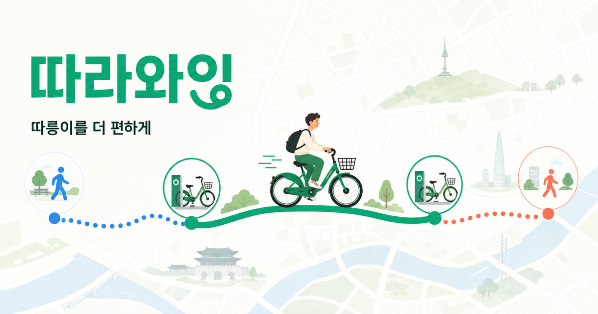

# 따라와잉

> 출발지부터 따릉이 대여·반납 대여소와 목적지까지 한 번에 안내하는 통합 경로 서비스

[서비스 바로가기](https://ttarawaing.vercel.app)



## 서비스 개요

따라와잉은 따릉이를 타기 전후로 여러 지도와 앱을 오가야 하는 불편을 줄이기 위해 만든 웹 서비스입니다. 출발지와 도착지만 선택하면 가까운 출발 대여소, 자전거 이동 경로, 목적지와 가까운 반납 대여소, 처음과 마지막 도보 구간을 하나의 여정으로 연결합니다.

```text
출발지 → 도보 → 출발 대여소 → 따릉이 → 반납 대여소 → 도보 → 목적지
```

## 해결하고 싶은 문제

- 따릉이 앱에서 가까운 대여소까지 가는 도보 경로를 바로 확인하기 어렵습니다.
- 지도 앱에서 목적지까지 자전거 경로를 찾은 뒤 반납 대여소를 다시 찾아야 합니다.
- 대여소에 도착했는데 이용 가능한 따릉이가 없으면 다른 대여소를 다시 검색해야 합니다.
- 장거리 이동 중 이용권 시간을 넘기면 추가 요금이 발생할 수 있습니다.

## 주요 기능

- 카카오맵 기반 서울·경기 장소 검색과 자동완성
- 현재 위치를 출발지로 사용하고 지도에서 이동 방향 확인
- 실시간 이용 가능 수량을 반영한 출발 대여소 추천
- 따릉이가 0대인 가장 가까운 대여소 대신 다음 최적 대여소 안내
- 목적지와 가까운 반납 대여소 및 대체 대여소 추천
- 카카오맵 REST API 기반 도보·자전거 경로선, 시간, 거리 계산
- `자전거도로 우선`과 `최단 경로` 선택
- 1시간권·2시간권·3시간권에 맞춘 최소 중간 반납·재대여 대여소 추천

## 이용권 경유 추천 기준

지도 예상 시간의 오차를 고려해 각 이용권에서 5분의 안전 여유를 둡니다.

| 이용권  | 한 구간의 안전 이용시간 |
| ------- | ----------------------: |
| 1시간권 |                    55분 |
| 2시간권 |                   115분 |
| 3시간권 |                   175분 |

자전거 이동시간이 안전 이용시간을 넘으면 실제 자전거 경로 주변의 운영 대여소를 탐색합니다. 필요한 최소 개수부터 경유 후보를 검증하고, 모든 자전거 구간이 이용권 시간 안에 들어오는 조합을 추천합니다. 중간 반납·재대여에는 회당 약 3분을 총 소요시간에 반영합니다.

## 기술 구성

| 영역      | 사용 기술                                             |
| --------- | ----------------------------------------------------- |
| UI        | Next.js 16, React 19, TypeScript                      |
| 지도      | Kakao Maps JavaScript SDK                             |
| 경로 계산 | Kakao Maps 도보·자전거 REST API                       |
| 서버      | vinext, Cloudflare Workers                            |
| 데이터    | 서울시 공공자전거 대여소 정보, 서울자전거 실시간 현황 |
| 테스트    | Node.js Test Runner, ESLint                           |

## 데이터와 추천 방식

- 대여소 위치는 서울시 공식 자료와 서울자전거 운영 목록을 사용합니다.
- 대여 가능 자전거 수는 서울자전거 실시간 현황을 우선 반영합니다.
- 실시간 연결이 실패하면 최근 운영 목록으로 추천을 유지하되 수량은 `수량 미확인`으로 표시합니다.
- 신뢰할 수 있는 빈 반납 슬롯 데이터가 없어 반납 대여소는 운영 상태와 목적지까지의 경로를 기준으로 추천합니다.
- 카카오 경로를 불러오지 못한 구간은 실제 도로 경로와 구분되도록 직선 점선 예상으로 표시합니다.
- `자전거도로 우선`은 가능한 자전거도로를 우선하는 옵션이며 모든 구간이 자전거 전용도로임을 보장하지 않습니다.

## 로컬 실행

Node.js 22.13 이상이 필요합니다.

```bash
npm install
```

프로젝트 루트에 `.env.local`을 만들고 다음 키를 설정합니다.

```dotenv
KAKAO_JAVASCRIPT_KEY=your_javascript_key
KAKAO_REST_API_KEY=your_rest_api_key
```

개발 서버를 실행합니다.

```bash
npm run dev
```

## 검증

```bash
npm run lint
npm test
```

`npm test`는 배포용 빌드와 전체 테스트를 함께 실행합니다.

## 참고 자료

- [카카오맵 JavaScript API](https://apis.map.kakao.com/web/guide/)
- [카카오맵 REST API](https://developers.kakao.com/docs/ko/kakaomap/rest-api)
- [서울시 공공자전거 실시간 대여정보](https://data.seoul.go.kr/dataList/OA-15493/A/1/datasetView.do)
- [서울시 공공자전거 대여소 정보](https://data.seoul.go.kr/dataList/OA-13252/F/1/datasetView.do)
